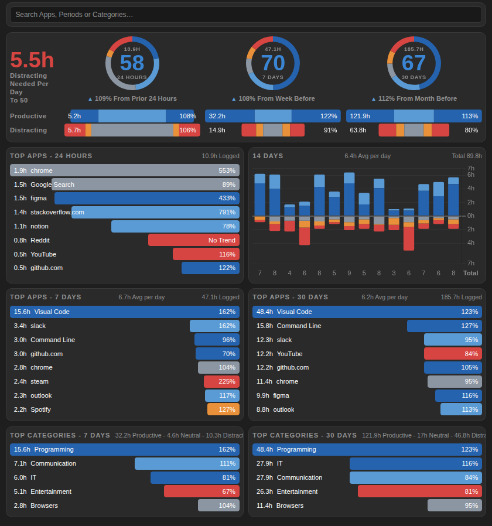
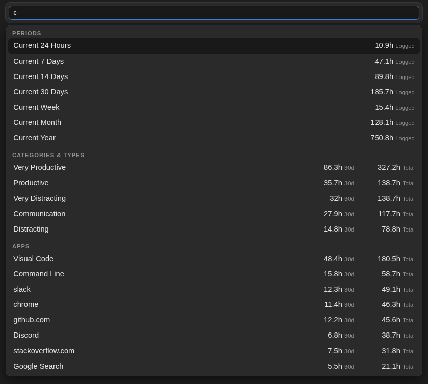
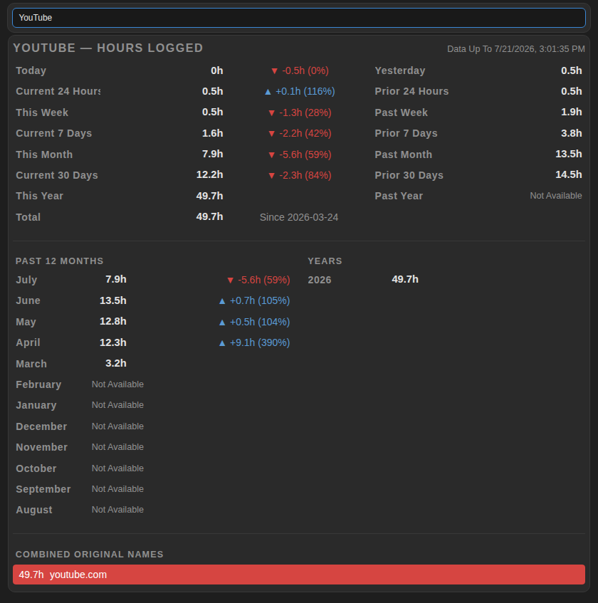

# RescueTime Overview

A self-hosted dashboard **website** for your [RescueTime](https://www.rescuetime.com) data — served for free on **GitHub Pages** and refreshed automatically every 30 minutes by a **GitHub Action**. It is a full standalone website first, with searchable drill-downs across your whole history — and because the layout stays compact and responsive, it also drops neatly into an iframe or website widget, for example on [start.me](https://start.me).

Your personal data **never enters the repository**: the workflow fetches it at run time and deploys it straight to the Pages site, so the repo only ever contains code.

*Screenshots show generated example data, not real usage.*

## What it shows

- **Pulse rings** for the current 24 hours, 7 days and 30 days — total hours logged, an activity score, and how you compare against the previous period.
- **Productive vs. Distracting** delta bars for each period.
- **Top apps** for 24 hours, 7 days and 30 days, with per-app trend percentages.
- **Top categories** for 7 and 30 days.
- A **14-day chart** stacking productive time above the line and distracting time below it.
- Rows link back to the matching report on rescuetime.com.

## The search bar

The search bar at the top is the power feature — one input that searches and cross-filters everything. Matching is loose: a suggestion appears when its name **contains** what you typed anywhere, not only when it starts with it — `tube` finds *YouTube*, `mail` finds *Gmail* and *Proton Mail*.

- **Apps** — type any app or website name and open a detail card with today / 24h / week / month / year / all-time totals, trends against the prior period, and a month-by-month + year-by-year history.
- **Time periods** — open any period as its own dashboard card (formats below).
- **Categories** — e.g. `Programming` or `Entertainment`, with the period's app breakdown.
- **Productivity types** — `Very Productive`, `Productive`, `Neutral`, `Distracting`, `Very Distracting`.

### Period formats the search bar understands

| Kind | Type this |
| --- | --- |
| Named windows | `Today`, `Yesterday`, `Current 24 Hours`, `Prior 24 Hours`, `Current 7 Days`, `Prior 7 Days` (same for `14` and `30 Days`), `Current Week`, `Past Week`, `Current Month`, `Past Month`, `Current Year`, `Past Year` |
| Calendar weeks | `Week 29` — this year's weeks, current week first |
| Calendar months | `July` (suggests that month for **every** year with data) or `July 2026` |
| Calendar years | `2026` |
| Single days | `21 07 26` (DD MM YY, with spaces — `21 07` alone finds that date across all years), or `Day 21 7 2026` / `Date 21 07 2026` in any zero-padding |

### Combine a filter with a period

Type a **category or productivity type followed by any period format above** to get exactly that slice as its own card with totals and app breakdown:

- `Games 2025` — all gaming in 2025
- `Entertainment July` — entertainment for July, across every year with data
- `Very Productive Week 29` — your most productive time in a specific week
- `Communication 21 07 26` — one category on one exact day

Apps don't need a combo: opening an app's detail card already shows every period at once, plus its full monthly and yearly history.

Everything in the suggestions respects a 0.5 h floor — apps, categories, and periods with less than half an hour logged stay hidden instead of cluttering the list.

Suggestions are grouped and labelled — typing even a single letter like `c` surfaces matching **periods**, **categories & types**, and **apps** side by side:

## Privacy by design

- The workflow deploys the site as a **Pages artifact** — `data.json` and `archive.json` are generated on the Actions runner and uploaded directly to the Pages servers. They are never committed, so they don't appear in the repo's file listing or its history.
- `docs/robots.txt` and a `noindex, nofollow, noarchive` meta tag keep the deployed site out of search engines and well-behaved AI crawlers.
- Your API key lives only in a GitHub **Actions secret** (and locally in a gitignored `Secrets.ini`).
- Be aware: GitHub Pages has no access control, so anyone who has the exact URL can view the site. Treat the URL as semi-private.

## Set it up for your own data

1. **Fork** this repository (or use it as a template).
2. Get your RescueTime API key: <https://www.rescuetime.com/anapi/manage>.
3. In your fork: *Settings → Secrets and variables → Actions → New repository secret*, name it `RT_KEY`, paste your key.
4. *Settings → Pages → Build and deployment → Source*: **GitHub Actions**. Do this **before** the first workflow run — the workflow can't enable Pages by itself, so until this is set every run fails with *"Get Pages site failed / Not Found"*.
5. Edit `.github/workflows/fetch-rescuetime.yml` and set `TZ:` to your RescueTime account's timezone.
6. Go to the *Actions* tab, enable workflows (GitHub disables scheduled workflows in forks until you do), open **Fetch RescueTime data** and press *Run workflow*.
7. The first run backfills your full available history (about 3 months on RescueTime Lite, more on Premium), then every later run only fetches the last ~3 days — fast and API-friendly.

Your dashboard is then live at `https://<your-username>.github.io/<repo-name>/`.

> **Note:** GitHub automatically pauses scheduled workflows after 60 days without repository activity. If updates stop, just re-enable the workflow in the Actions tab.

## Use it as a widget (optional)

The dashboard is a normal website you can open and use directly — but it also embeds cleanly. Point any iframe/embed widget at your Pages URL; on start.me, add an **Embed** widget with the URL above. `index.html` shows the full panel plus a footer countdown to the next data refresh; you can also embed `All-Data.html` directly if you don't want the footer.

## Customize display names & types

Edit `docs/dictionary.json`. Two sections, both this-site-only (RescueTime itself is never changed):

- `Apps` — e.g. `{ "OriginalName": ["ffx", "ffx-2"], "NewName": "Final Fantasy 10", "NewCategory": "Games" }`. Combine several raw activity names under one `NewName`; `NewCategory` (optional) assigns those apps a category. Omit `NewCategory` to keep RescueTime's category.
- `Categories` — e.g. `{ "OriginalName": ["Games", "General Entertainment"], "NewName": "Fun", "NewType": "Personal" }`. Combine/rename categories and, optionally, re-type them (`NewType` = Work | Productive | Neutral | Personal | Distracting). Omit `NewType` to keep RescueTime's type.

Matching is case-insensitive on the raw RescueTime names. Type/category changes take effect on the next data fetch. Detail cards list the original raw names that were combined, so nothing gets hidden.

## Run it locally (optional)

On Windows, create a `Secrets.ini` in the repo root containing `key=YOUR_API_KEY`, then use the scripts in `scripts/`:

- `scripts\Fetch-Data.ps1` — runs the same fetch script the Action uses and updates `docs/` locally.
- `scripts\"Serve Temporary Website.ps1"` — serves the site on localhost while the window stays open (for previewing changes).
- `scripts\"Install and Start persistent Local Website.ps1"` — sets up a background server (restarts on login) plus a 30-minute auto-fetch, so the local site stays live and current on its own; `scripts\"Stop Local persistent Website.ps1"` undoes it.

`Secrets.ini`, `docs/data.json` and `docs/archive.json` are gitignored, so local runs never push personal data.

## How updating works

`scripts/fetch-addition.py` keeps a per-day archive (`archive.json`). Days in the past never change, so they are downloaded once; every run only re-fetches the last 3 days plus the hourly rows for the rolling 24-hour view, then rebuilds `data.json` from the archive. Between runs the archive lives on the deployed site itself — each workflow run restores it from there. If it's ever missing, the script simply backfills the whole history again on the next run.
